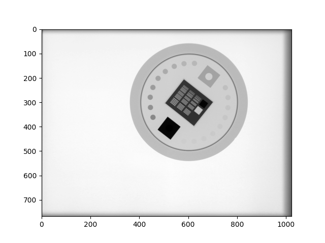
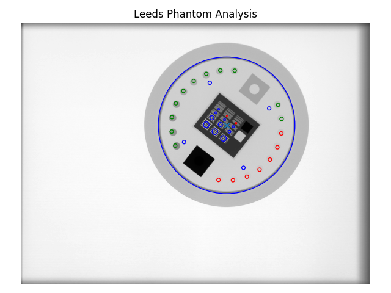
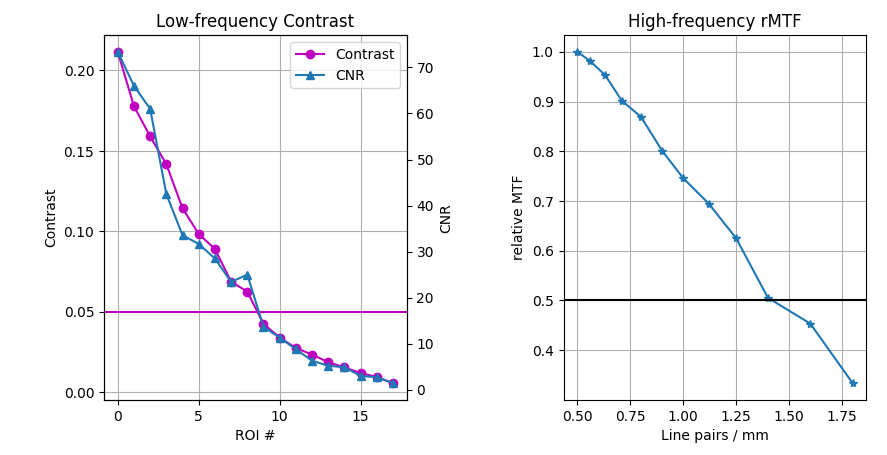

# Summary

Pylinac is a Python library that analyzes routine quality assurance images generated by
devices in the radiotherapy treatment domain. It contains multiple independent modules
that map to different quality assurance tasks and will ingest and analyze the images for common metrics as required by the medical
physics society. The library is designed to be concise and easy to use as the target audience is not
developers. Thus, most workflows can be implemented in a few lines of code. At the same time,
the library is modular and allows for easy extension via plugins and configuration settings.
Comprehensive documentation is available with usage examples and algorithm explanations.


# Statement of need

Within the therapeutic medical physics domain, verification that radiotherapy machines are
performing in accordance with specification is an obvious need considering their use on
humans and is required by relevant societies [@Kutcher1994; @Klein2009; @Dieterich2008]. This involves
routine quality assurance (QA) at regular intervals by medical physicists. A subset of this QA
involves acquisition and analysis of images generated by the radiotherapy devices.
This includes the mechanical size of the "isocenter" of the linear accelerator [@Winston1988],
dosimetric performance of the accelerator as it rotates around the patient [@Ling2008], and examination
of the individual "leaves" of the multileaf collimator that shape the radiation [@Calvo2014].
These images and data test the various mechanical and dosimetric performance dimensions of the machine.
The images are usually the same pattern at every interval and are used for constancy testing.
Manual examination of images is subject to interpersonal interpretation [@Ho1995; @Kerns2013].
Performing this quality assurance has been examined as being quantifiable by image or digital analysis in the past [@Depuydt2012; @Rowshanfarzad2011; @Du2009; @Eckhause2015; @Jorgensen2011; @Kerns2014].
Commercial applications exist but can be prohibitively expensive
and at the time the library was written no open-source alternatives existed.
Medical physicists usually do not have computer science training and creating their
own in-house software for such evaluation can be difficult to justify.
There is thus a need for software for budget-constrained radiotherapy clinics as well
as an open standard for analysis of these data instead of proprietary programs made by individual authors and clinics.

# Example usage

Although pylinac contains multiple independent modules focused on analyzing different images,
this example will focus on one: planar image analysis for image metrics of a radiation source
and camera combination. Linear accelerators have a built-in scintillation camera that can
record and visualize radiation. As part of the routine quality assurance, the
performance of the camera is measured monthly and annually. This is performed with a device
that can measure contrast and spatial resolution or more, also known as a “phantom”.
A device is placed in the path of the beam and the image is captured on the scintillating
camera (\autoref{fig:fig1}).



The image can be exported in the format of the Digital Imaging and Communications in Medicine (DICOM). This DICOM image can be passed to
pylinac and analyzed. The only input required is the image and the type of phantom being analyzed.

```python
from pylinac import LeedsTOR

dicom_path = r"path\to\dicom.dcm"
leeds = LeedsTOR(dicom_path)
leeds.analyze()
leeds.plot_analyzed_image()
```

Pylinac will localize the phantom within the image, meaning the user’s placement of the phantom
is not a variable. Rotation can be corrected within a certain range, usually within 5 degrees for
most phantoms. This also removes the placement technique of the user as a result variable. After
localization and rotational correction, each region of interest (ROI) is then sampled, of which there can be several.
Each phantom’s ROIs are known ahead of time so simple offsets based on the phantom center and angle can be utilized.
After the ROIs are sampled (\autoref{fig:fig2}) the metrics can be computed (\autoref{fig:fig3}).



The most common metrics are contrast and spatial resolution. Contrast can be defined many ways,
but the default one in pylinac is:

$$\frac{I_{mean} - R_{mean}}{I_{mean} + R_{mean}}$$

where $I$ is the ROI of the contrast region in question and $R$ is the background ROI, usually
placed somewhere within the phantom area that is uniform.

This corresponds to the circular ROIs at the outer edge of
the phantom (\autoref{fig:fig2}). The contrast is calculated for each ROI and can then be plotted as a curve.
Spatial resolution is defined as

$$\frac{ \frac{I_{max} - I_{min}}{I_{max} + I_{min}}}{\max{\left( \frac{I_{max} - I_{min}}{I_{max} + I_{min}}\right)}}$$

where $I = {1...n}$ line pair ROIs.
This is also called the modulation transfer function (MTF) [@Schroeder1981].
The ROIs at the center of the phantom with the quickly-alternating lines define the spatial resolution.
For each ROI, the spacing of a high-density and low-density material is fixed.
The spatial resolution of each ROI is calculated and can be plotted as a curve.
Typically, the medical physicist is looking at the resolution value at the 50% line of the curve (\autoref{fig:fig3}).



After analysis, these values are used by the medical physicist to compare to previous values or expected values.
From there, calibration of the camera may be necessary.
The results can also be saved as records that may be audited by government authorities.

# Adoption and impact

Pylinac has been used widely in literature since its release in 2014, either validation of
the algorithms for use by individual clinics [@Boudet2022; @Bredikin2022; @Ji2022; @Lay2022], as a research tool for other ends [@Tegtmeier2022; @Bozhikov2019; @Pant2020; @Alkabkabi2022; @Alexander2021; @Wang2020; @Huang2021; @Salari2023; @Hu2022; @Cullom2021; @Wojtasik2020; @Mendes2022; @Pearson2022],
or used within other packages [@Lay2022Tardis; @Oliver2022; @Chuang2021]


# Author contribution statement

Conceptualization, coding, development, and paper writing by James Kerns.

# Acknowledgements

We thank Radformation for continuing to support the open-source work of this project
and Dr. Stephen Kry for providing protected time to initially develop the project.
Several individuals have contributed to the project over the years, which can be
viewed here: https://github.com/jrkerns/pylinac/graphs/contributors.

# References
